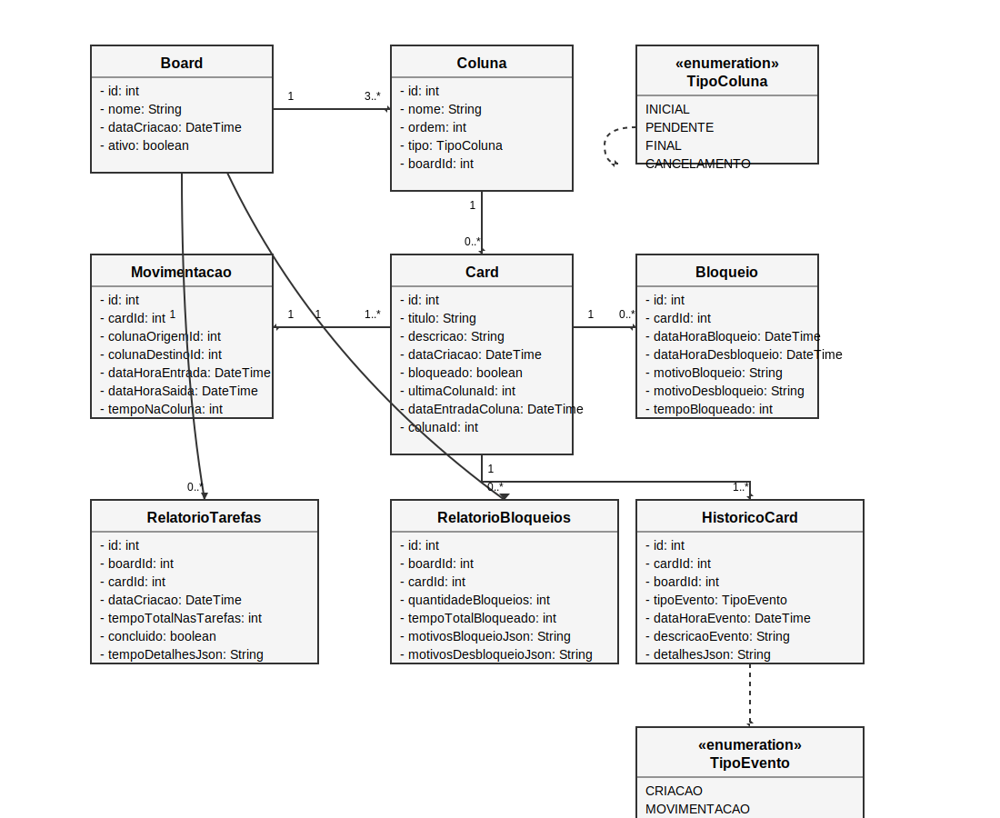

# QuadroKaban

## Descrição

O **QuadroKaban** é um sistema de gerenciamento de tarefas inspirado no método Kanban, desenvolvido em Java com Spring Boot.  
Permite criar boards personalizados, adicionar colunas e cards, controlar movimentações, bloqueios e gerar relatórios detalhados de produtividade e bloqueios.

> **Este projeto foi desenvolvido como solução para o desafio da Digital Innovation One (DIO):  
> [Técnicas Avançadas, Padrões e Persistência (Literalmente)](https://github.com/digitalinnovationone/exercicios-java-basico/blob/main/projetos/4%20-%20T%C3%A9cnicas%20Avan%C3%A7adas%2C%20Padr%C3%B5es%20e%20Persist%C3%AAncia%20(Literalmente).md)**

## Funcionalidades

- Menu interativo para criar, selecionar e excluir boards
- Persistência de dados em banco relacional (MariaDB no desenvolvimento, PostgreSQL em produção)
- Cada board possui colunas configuráveis (inicial, pendente, final, cancelamento)
- Cards podem ser criados, movidos, bloqueados e desbloqueados conforme regras de negócio
- Relatórios de tempo de tarefas e bloqueios por board
- Histórico de movimentações e eventos dos cards

## Tecnologias Utilizadas

- Java 17
- Spring Boot 3
- Spring Data JPA
- MariaDB (desenvolvimento)
- PostgreSQL (produção)
- Gradle
- JPA/Hibernate

## Como rodar o projeto

1. **Clone o repositório:**
   ```sh
   git clone https://github.com/SEU_USUARIO/quadrokaban.git
   cd quadrokaban
   ```

2. **Configure o banco de dados:**
   - Para desenvolvimento, ajuste o arquivo `src/main/resources/application-dev.yml` com os dados do seu MariaDB.
   - Para produção, ajuste o arquivo `src/main/resources/application-prod.yml` com os dados do seu PostgreSQL.

3. **Execute o projeto:**
   - Desenvolvimento (MariaDB):
     ```sh
     ./gradlew bootRun
     ```
   - Produção (PostgreSQL):
     ```sh
     ./gradlew bootRun --args='--spring.profiles.active=prod'
     ```

## Estrutura do Projeto

```
src/main/java/com/reury/kabanquadro/
  model/         # Entidades JPA
  repository/    # Repositórios Spring Data
  service/       # Lógica de negócio
  controller/    # Menu CLI ou REST
```

## Modelo UML

O projeto segue o seguinte modelo UML:



### Entidades Principais

- **Board**: id, nome, dataCriacao, ativo, colunas
- **Coluna**: id, nome, ordem, tipo, boardId
- **Card**: id, titulo, descricao, dataCriacao, bloqueado, ultimaColunaId, dataEntradaColuna, colunaId
- **Movimentacao**: id, cardId, colunaOrigemId, colunaDestinoId, dataHoraEntrada, dataHoraSaida, tempoNaColuna
- **Bloqueio**: id, cardId, dataHoraBloqueio, dataHoraDesbloqueio, motivoBloqueio, motivoDesbloqueio, tempoBloqueado
- **RelatorioTarefas**: id, boardId, cardId, dataCriacao, tempoTotalNasTarefas, concluido, tempoDetalhesJson
- **RelatorioBloqueios**: id, boardId, cardId, quantidadeBloqueios, tempoTotalBloqueado, motivosBloqueioJson, motivosDesbloqueioJson
- **HistoricoCard**: id, cardId, boardId, tipoEvento, dataHoraEvento, descricaoEvento, detalhesJson

### Regras de Negócio

- Cada board deve ter pelo menos 3 colunas (inicial, final, cancelamento)
- Só pode haver uma coluna de cada tipo especial por board (inicial, final, cancelamento)
- Cards só podem ser movidos para a próxima coluna, exceto para cancelamento
- Cards bloqueados não podem ser movidos
- Bloqueio/desbloqueio exige justificativa
- Relatórios de tempo e bloqueios disponíveis por board

---

## Licença

Este projeto é open-source, licenciado sob a [Licença MIT](LICENSE), com todos os créditos de autoria para [Reury](https://github.com/Reury).

---

> Para dúvidas ou sugestões, abra uma issue no repositório.